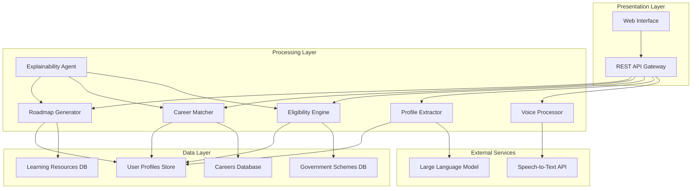

# Design Document: PathWise AI

## Overview

PathWise AI is a voice-first eligibility reasoning and career feasibility system designed for Indian students. The system leverages modern AI technologies including speech recognition, natural language processing, and machine learning to provide personalized career guidance and government scheme eligibility assessment.

The architecture follows a microservices approach with clear separation of concerns, enabling scalability and maintainability. The system processes voice or text input through a multi-stage pipeline: voice processing → profile extraction → eligibility evaluation → career matching → roadmap generation, with explainable AI principles integrated throughout.

Hackathon Scope Clarification
For the hackathon, PathWise AI focuses on discovery, eligibility reasoning, and guidance rather than full automation. The system demonstrates how AI can help users understand available opportunities, why they are eligible or not, and what next steps to take, using a voice-first and text-based interface optimized for Indian students and low-access environments.

## Target Users

**Primary Users**
- Students in India (Class 10 to Graduation) from Tier-2 and Tier-3 regions
- Students with limited awareness of government schemes, career pathways, or digital tools
- Users more comfortable with voice interaction than complex forms

**Secondary Users**
- Academic dropouts or career switchers
- First-generation learners seeking skill-based employment

## Architecture

The system uses a layered architecture with the following components:


## Example User Journey (Demonstration Scenario)

Ramesh, an 18-year-old student from Andhra Pradesh, has completed Class 12 with a science background. His family income is below ₹3 lakhs per year, and he is unsure about career options and available financial support.

1. Ramesh speaks into the system:  
   “I finished 12th with science and want to study engineering, but my family income is low.”

2. PathWise AI transcribes the input and extracts his profile (education level, interests, income bracket, and location).

3. The Eligibility Engine evaluates relevant government schemes and explains:
   - Which scholarships or education loans he is eligible for
   - Why certain schemes are not applicable

4. The Career Matcher suggests engineering-related career paths and highlights required skills.

5. The Roadmap Generator provides a step-by-step learning and preparation plan using free or low-cost resources.

6. The Explainability Agent presents decisions in simple language with confidence levels.

## Components and Interfaces

### Voice Processor
**Responsibility**: Convert speech input to text with support for Hindi, English, and Hinglish
**Technology**: Integration with speech-to-text services optimized for Indian accents (e.g., Soniox, Google Speech-to-Text with Indian language models)
**Interface**:
```typescript
interface VoiceProcessor {
  processAudio(audioBlob: Blob, language: 'hi' | 'en' | 'hinglish'): Promise<TranscriptionResult>
  detectLanguage(audioBlob: Blob): Promise<LanguageDetection>
  validateAudioQuality(audioBlob: Blob): Promise<QualityAssessment>
}

interface TranscriptionResult {
  text: string
  confidence: number
  language: string
  alternativeTranscriptions?: string[]
}
```

### Profile Extractor
**Responsibility**: Extract structured user information from unstructured text using NLP
**Technology**: Fine-tuned language models (e.g., BERT-based models) with custom NER for Indian context
**Interface**:
```typescript
interface ProfileExtractor {
  extractProfile(text: string): Promise<UserProfile>
  validateProfile(profile: UserProfile): ValidationResult
  identifyMissingFields(profile: UserProfile): string[]
}

interface UserProfile {
  demographics: {
    age?: number
    location?: string
    educationLevel?: string
    institution?: string
  }
  skills: {
    technical: string[]
    soft: string[]
    certifications: string[]
  }
  background: {
    familyIncome?: string
    category?: string // General/OBC/SC/ST
    disability?: boolean
  }
  goals: {
    careerInterests: string[]
    timeframe?: string
  }
}
```

### Eligibility Engine
**Responsibility**: Evaluate user eligibility for government schemes with explainable reasoning
**Technology**: Rule-based engine with fuzzy matching for borderline cases
**Interface**:
```typescript
interface EligibilityEngine {
  evaluateEligibility(profile: UserProfile): Promise<EligibilityResult[]>
  explainDecision(schemeId: string, profile: UserProfile): Promise<ExplanationResult>
  suggestImprovements(schemeId: string, profile: UserProfile): Promise<ImprovementSuggestion[]>
}

interface EligibilityResult {
  schemeId: string
  schemeName: string
  eligible: boolean
  confidence: number
  reasoning: string[]
  requiredActions?: string[]
  deadline?: Date
}
```

### Career Matcher
**Responsibility**: Match user skills against career requirements and identify skill gaps
**Technology**: Cosine similarity with skill embeddings, weighted by importance and market demand
**Interface**:
```typescript
interface CareerMatcher {
  matchCareers(profile: UserProfile): Promise<CareerMatch[]>
  analyzeSkillGaps(profile: UserProfile, careerId: string): Promise<SkillGapAnalysis>
  rankCareersByFit(profile: UserProfile, careerIds: string[]): Promise<CareerRanking[]>
}

interface CareerMatch {
  careerId: string
  careerName: string
  fitPercentage: number
  requiredSkills: string[]
  matchedSkills: string[]
  missingSkills: string[]
  marketDemand: 'high' | 'medium' | 'low'
  averageSalary?: number
}
```

### Roadmap Generator
**Responsibility**: Create personalized learning paths based on skill gaps and career goals
**Technology**: Graph-based path finding with learning resource optimization
**Interface**:
```typescript
interface RoadmapGenerator {
  generateRoadmap(skillGaps: SkillGapAnalysis, timeframe: string): Promise<LearningRoadmap>
  optimizeForAccessibility(roadmap: LearningRoadmap): Promise<LearningRoadmap>
  trackProgress(roadmapId: string, completedItems: string[]): Promise<ProgressUpdate>
}

interface LearningRoadmap {
  roadmapId: string
  totalDuration: string
  phases: LearningPhase[]
  milestones: Milestone[]
  resources: LearningResource[]
}
```

## Data Models

### Government Schemes Database Schema
```typescript
interface GovernmentScheme {
  id: string
  name: string
  description: string
  eligibilityCriteria: {
    ageRange?: { min: number, max: number }
    educationLevel?: string[]
    familyIncome?: { max: number }
    category?: string[] // General/OBC/SC/ST
    location?: string[] // State/District restrictions
    disability?: boolean
    customCriteria?: Record<string, any>
  }
  benefits: {
    type: 'scholarship' | 'loan' | 'training' | 'placement'
    amount?: number
    duration?: string
    description: string
  }
  applicationProcess: {
    portal: string
    documents: string[]
    deadline?: Date
    steps: string[]
  }
  lastUpdated: Date
  isActive: boolean
}
```

### Career Database Schema
```typescript
interface Career {
  id: string
  name: string
  description: string
  requiredSkills: {
    technical: SkillRequirement[]
    soft: SkillRequirement[]
    certifications: string[]
  }
  marketData: {
    demand: 'high' | 'medium' | 'low'
    growthRate: number
    averageSalary: {
      entry: number
      mid: number
      senior: number
    }
    topEmployers: string[]
  }
  educationPaths: string[]
  relatedCareers: string[]
  lastUpdated: Date
}

interface SkillRequirement {
  skill: string
  importance: 'critical' | 'important' | 'nice-to-have'
  proficiencyLevel: 'beginner' | 'intermediate' | 'advanced'
}
```

### Learning Resources Schema
```typescript
interface LearningResource {
  id: string
  title: string
  type: 'course' | 'certification' | 'project' | 'book' | 'video'
  provider: string
  cost: number // 0 for free resources
  duration: string
  difficulty: 'beginner' | 'intermediate' | 'advanced'
  skills: string[]
  language: string[]
  rating: number
  prerequisites: string[]
  url: string
  isAccessible: boolean // For users with disabilities
}
```

## Correctness Properties

*A property is a characteristic or behavior that should hold true across all valid executions of a system—essentially, a formal statement about what the system should do. Properties serve as the bridge between human-readable specifications and machine-verifiable correctness guarantees.*

Based on the prework analysis and property reflection to eliminate redundancy, the following properties validate the core system behaviors:

### Property 1: Voice Processing Accuracy and Robustness
*For any* audio input in Hindi, English, or Hinglish, the Voice_Processor should produce accurate transcriptions with appropriate confidence scores, handle poor audio quality gracefully by requesting clarification, and fallback to text input when processing fails completely.
**Validates: Requirements 1.1, 1.2, 1.3, 1.4, 1.5**

### Property 2: Profile Extraction Completeness and Accuracy  
*For any* unstructured text input describing a user's background, the Profile_Extractor should correctly identify and categorize demographic information, skills, and socioeconomic indicators, identify missing critical fields, and request confirmation when extraction confidence is low.
**Validates: Requirements 2.1, 2.2, 2.3, 2.4, 2.5**

### Property 3: Eligibility Evaluation Comprehensiveness
*For any* complete user profile, the Eligibility_Engine should evaluate eligibility against all relevant government schemes, provide clear reasoning for both acceptance and rejection decisions, suggest improvement actions for borderline cases, and prioritize time-sensitive opportunities appropriately.
**Validates: Requirements 3.1, 3.2, 3.3, 3.4, 3.5**

### Property 4: Career Matching Accuracy and Ranking
*For any* user profile with identified skills, the Career_Matcher should accurately compare skills against career requirements, quantify skill gaps with importance weighting, rank multiple careers by fit percentage, and incorporate both emerging skills and regional opportunities.
**Validates: Requirements 4.1, 4.2, 4.3, 4.4, 4.5**

### Property 5: Learning Roadmap Generation and Prioritization
*For any* identified skill gaps and timeline constraints, the Roadmap_Generator should create structured learning sequences with specific resources, prioritize high-impact activities under time constraints, favor accessible/free resources when available, and include measurable milestones.
**Validates: Requirements 5.1, 5.2, 5.3, 5.4, 5.5**

### Property 6: Decision Explainability and Transparency
*For any* system decision (eligibility, career matching, or roadmap generation), the PathWise_AI should provide step-by-step reasoning, explain criteria and weights used, justify sequences and priorities, communicate confidence levels for uncertain decisions, and provide additional details when requested.
**Validates: Requirements 6.1, 6.2, 6.3, 6.4, 6.5**

### Property 7: Accessibility and Language Support
*For any* user with accessibility needs, the PathWise_AI should provide text-based alternatives to voice input and handle common Indian regional language patterns correctly.
**Validates: Requirements 7.2, 7.3**

### Property 8: Data Privacy and Security Compliance
*For any* personal data interaction, the PathWise_AI should obtain explicit consent before collection, encrypt sensitive stored information, minimize data collection to essentials, completely remove data upon deletion requests, and anonymize information shared with external services.
**Validates: Requirements 8.1, 8.2, 8.3, 8.4, 8.5**

### Property 9: Government Scheme Database Management
*For any* government scheme data operation, the PathWise_AI should maintain comprehensive scheme coverage, update eligibility criteria when schemes change, incorporate new schemes into evaluation, remove expired schemes from consideration, and flag uncertain information for verification.
**Validates: Requirements 9.1, 9.2, 9.3, 9.4, 9.5**

### Property 10: Demonstration and Visualization Capabilities
*For any* demonstration scenario, the PathWise_AI should provide clear before/after comparisons for sample inputs, generate visual representations of decision reasoning, handle realistic Indian student scenarios appropriately, and maintain fallback modes during technical issues.
**Validates: Requirements 10.2, 10.3, 10.4, 10.5**

## Error Handling

The system implements comprehensive error handling across all components:

### Voice Processing Errors
- **Audio Quality Issues**: Automatic quality assessment with user feedback for improvement
- **Language Detection Failures**: Graceful fallback to manual language selection
- **Transcription Failures**: Immediate fallback to text input mode with user notification
- **Network Connectivity**: Offline mode with local processing capabilities where possible

### Profile Extraction Errors
- **Ambiguous Information**: Confidence scoring with clarification requests for low-confidence extractions
- **Missing Critical Data**: Progressive disclosure to collect missing information without overwhelming users
- **Invalid Data Formats**: Input validation with helpful error messages and format examples
- **Processing Timeouts**: Chunked processing for large inputs with progress indicators

### Eligibility and Matching Errors
- **Incomplete Profiles**: Partial evaluation with clear indication of missing information impact
- **Database Unavailability**: Cached results with staleness indicators and retry mechanisms
- **Scheme Data Inconsistencies**: Conflict resolution with manual review flags
- **Calculation Errors**: Input validation and result verification with audit trails

### System-Level Error Handling
- **Service Unavailability**: Circuit breaker patterns with graceful degradation
- **Data Corruption**: Checksums and validation with automatic recovery procedures
- **Performance Degradation**: Load balancing and resource scaling with user notifications
- **Security Violations**: Immediate session termination with incident logging

## Testing Strategy

**Note**  
For the hackathon prototype, testing focuses on validating core user flows, eligibility logic correctness, and explainability outputs using representative sample profiles. Advanced property-based and large-scale testing are part of future work.

The testing approach combines unit testing for specific scenarios with property-based testing for comprehensive validation:

### Unit Testing Focus
- **Specific Examples**: Test concrete scenarios with known inputs and expected outputs
- **Edge Cases**: Boundary conditions, empty inputs, maximum values, and error conditions  
- **Integration Points**: Component interactions, API contracts, and data flow validation
- **Error Scenarios**: Specific failure modes and recovery mechanisms

### Property-Based Testing Configuration
- **Testing Framework**: Use Hypothesis (Python) or fast-check (TypeScript) for property-based testing
- **Test Iterations**: Minimum 100 iterations per property test to ensure comprehensive coverage
- **Input Generation**: Custom generators for Indian names, locations, skills, and realistic user profiles
- **Shrinking Strategy**: Automatic test case minimization to identify minimal failing examples

### Property Test Implementation
Each correctness property will be implemented as a property-based test with the following structure:

```python
# Example property test structure
@given(user_profile=indian_student_profile_generator())
def test_eligibility_evaluation_comprehensiveness(user_profile):
    """
    Feature: pathwise-ai, Property 3: Eligibility Evaluation Comprehensiveness
    For any complete user profile, eligibility evaluation should be comprehensive
    """
    result = eligibility_engine.evaluate_eligibility(user_profile)
    
    # Verify all applicable schemes are evaluated
    assert len(result.evaluated_schemes) >= expected_scheme_count(user_profile)
    
    # Verify reasoning is provided for all decisions
    for scheme_result in result.scheme_results:
        assert len(scheme_result.reasoning) > 0
        if scheme_result.eligible:
            assert "acceptance" in scheme_result.reasoning_type
        else:
            assert "rejection" in scheme_result.reasoning_type
```

### Test Data Management
- **Synthetic Data Generation**: Create realistic but synthetic Indian student profiles for testing
- **Anonymized Real Data**: Use anonymized real data samples for validation (with proper consent)
- **Scheme Data Mocking**: Mock government scheme database with realistic but test-specific data
- **Multilingual Test Cases**: Include Hindi, English, and Hinglish test cases for voice processing

### Performance and Load Testing
- **Response Time Validation**: Ensure end-to-end workflows complete within acceptable timeframes
- **Concurrent User Testing**: Validate system behavior under multiple simultaneous users
- **Resource Usage Monitoring**: Memory, CPU, and network usage under various load conditions
- **Scalability Testing**: Verify system can handle increasing user loads and data volumes